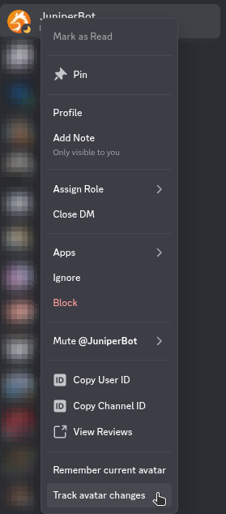
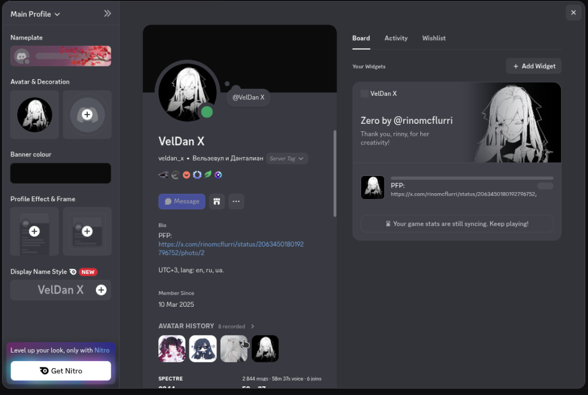
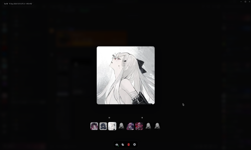

# AvatarHistory

Vencord / Equicord userplugin that passively records avatar changes and lets you browse the history right from the user profile.

**English** · [Русский](#русский)

## Features

- Tracks your own avatar changes (toggle in settings)
- Track any user via right-click → "Track avatar changes"
- Optionally auto-track all your friends (toggle in settings)
- Syncs the last 6 avatars that Discord keeps server-side
- Profile section with a 4-avatar preview; click opens the fullscreen viewer
- Lightbox: navigate, download, copy URL, delete, "remember current avatar"
- Offline copies (blobs, ≤ 10 MB each) stay viewable even after the CDN drops an avatar
- Export / import history as JSON
- Auto-purge of records that no longer resolve on the CDN

## Preview

**Right-click a user** — the plugin adds "Remember current avatar" (save the current avatar into the history) and "Track avatar changes" (start tracking this user's avatar changes):



**Profile section** — the user profile modal shows an "AVATAR HISTORY" section with a preview of the last 4 avatars; clicking any preview opens the fullscreen gallery:



**Lightbox** — fullscreen viewer over the whole history: large preview, a "1 of N" counter and the record timestamp (UTC) on top, an action bar at the bottom (download, copy URL, delete, "More" menu), and a rail of all saved avatars below:



## Settings

| Setting | Default | Description |
| ------- | ------- | ----------- |
| trackSelf | ✔ | Track your own avatar changes |
| trackFriends | ✘ | Auto-track avatar changes of all your friends |

## Installation

Same steps for Vencord and Equicord — for Equicord, the plugin also goes into `src/userplugins/`.

> **Warning:** requires the developer build — production builds ship without userplugins.
>
> - Vencord (developer build): <https://docs.vencord.dev/installing/>
> - Equicord (developer build): <https://docs.equicord.org/plugins>

### Option 1: Clone

```
git clone https://github.com/VelDanX/AvatarHistory src/userplugins/avatarHistory
```

or via Codeberg:

```
git clone https://codeberg.org/VelDanX/AvatarHistory src/userplugins/avatarHistory
```

Then follow the [official Vencord custom plugins guide](https://docs.vencord.dev/plugins/developers/)
(`pnpm install && pnpm build`). The plugin is auto-discovered, no extra config needed.

### Option 2: Manual download

1. Download the ZIP from [GitHub](https://github.com/VelDanX/AvatarHistory) or [Codeberg](https://codeberg.org/VelDanX/AvatarHistory).
2. Unzip into `src/userplugins/` so the plugin ends up as `src/userplugins/avatarHistory` (a trailing `-main` suffix is fine).
3. Run `pnpm install && pnpm build` in the repo root.

## Mirrors

- GitHub: <https://github.com/VelDanX/AvatarHistory>
- Codeberg: <https://codeberg.org/VelDanX/AvatarHistory>

## Data storage

All data stays local (IndexedDB via Vencord's DataStore). Nothing is synced to the cloud.

| Key | Content |
| --- | ------- |
| `vc-avh-history` | Per-user metadata (hash, timestamp, format, dimensions) |
| `vc-avh-tracked` | Manually tracked user IDs |
| `vc-avh-blob:<userId>:<hash>` | Offline image copy as a Blob (≤ 10 MB) |

## License

GPL-3.0-or-later — see `LICENSE`.

---

## Русский

<a name="русский"></a>
Плагин для Vencord / Equicord: пассивно записывает смены аватаров и показывает историю прямо в профиле пользователя.

## Возможности

- Автоотслеживание смены своего аватара (тогл в настройках)
- Отслеживание любого пользователя через ПКМ → «Track avatar changes»
- Опциональное автоотслеживание всех друзей (тогл «Track friends»)
- Синхронизация последних 6 аватаров с сервера Discord
- Секция в профиле с превью 4 аватаров; клик открывает полноэкранный просмотр
- Лайтбокс: листание, скачивание, копия URL, удаление, «запомнить текущий аватар»
- Офлайн-копии (blobs ≤ 10 МБ) остаются доступными даже после удаления аватара с CDN
- Экспорт / импорт истории в JSON
- Автоочистка записей, которых больше нет на CDN

## Превью

**Клик правой кнопкой по пользователю** — плагин добавляет пункты «Remember current avatar» (сохранить текущий аватар в историю) и «Track avatar changes» (начать отслеживать смены аватара):


**Секция в профиле** — в модалке профиля отображается секция «AVATAR HISTORY» с превью последних 4 аватаров; клик по любому превью открывает полноэкранную галерею:


**Галерея (лайтбокс)** — полноэкранный просмотр всей истории: крупный аватар, счётчик «1 of N» и дата записи (UTC) сверху, панель действий снизу (скачивание, копия URL, удаление, меню «More») и лента всех сохранённых аватаров:


## Настройки

| Настройка | По умолчанию | Описание |
| --------- | ------------ | -------- |
| trackSelf | ✔ | Отслеживать свой аватар |
| trackFriends | ✘ | Автоотслеживание аватаров всех друзей |

## Установка

Шаги одинаковы для Vencord и Equicord — в Equicord плагин также кладётся в `src/userplugins/`.

> **Внимание:** нужна developer-сборка — в production-сборках плагинов нет.
>
> - Vencord (developer-сборка): <https://docs.vencord.dev/installing/>
> - Equicord (developer-сборка): <https://docs.equicord.org/plugins>

### Вариант 1: Клонирование

```
git clone https://github.com/VelDanX/AvatarHistory src/userplugins/avatarHistory
```

или через Codeberg:

```
git clone https://codeberg.org/VelDanX/AvatarHistory src/userplugins/avatarHistory
```

Затем следуйте [официальному гайду по плагинам Vencord](https://docs.vencord.dev/plugins/developers/)
(`pnpm install && pnpm build`). Плагин подхватывается автоматически.

### Вариант 2: Скачать вручную

1. Скачайте ZIP с [GitHub](https://github.com/VelDanX/AvatarHistory) или [Codeberg](https://codeberg.org/VelDanX/AvatarHistory).
2. Распакуйте в `src/userplugins/`, чтобы получилось `src/userplugins/avatarHistory` (суффикс `-main` тоже подходит).
3. Запустите `pnpm install && pnpm build` в корне репозитория.

## Зеркала

- GitHub: <https://github.com/VelDanX/AvatarHistory>
- Codeberg: <https://codeberg.org/VelDanX/AvatarHistory>

## Где хранятся данные

Все данные хранятся локально (IndexedDB через DataStore Vencord). В облако ничего не синхронизируется.

| Ключ | Содержимое |
| ---- | ---------- |
| `vc-avh-history` | Метаданные записей по пользователям (hash, timestamp, формат, размеры) |
| `vc-avh-tracked` | Вручную отслеживаемые ID |
| `vc-avh-blob:<userId>:<hash>` | Офлайн-копия изображения как Blob (≤ 10 МБ) |

## Лицензия

GPL-3.0-or-later — см. `LICENSE`.